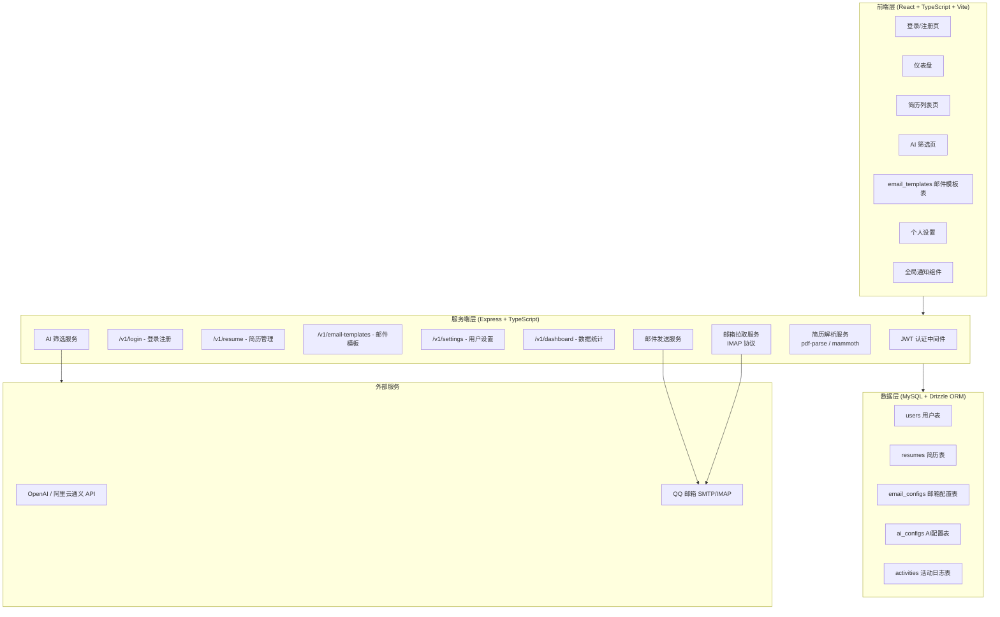
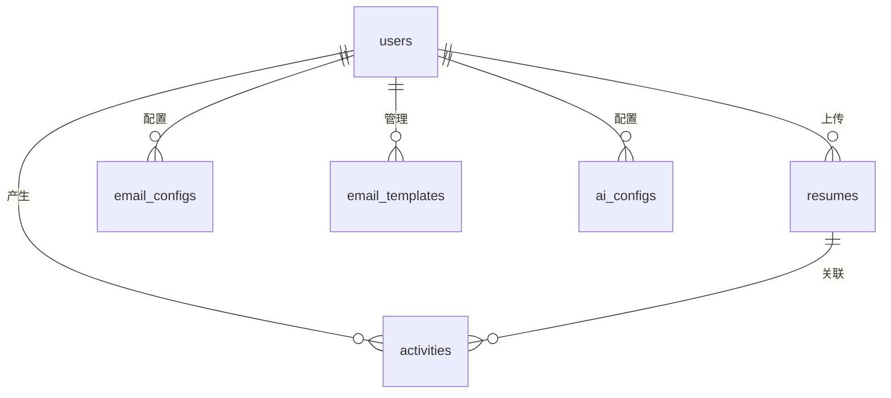
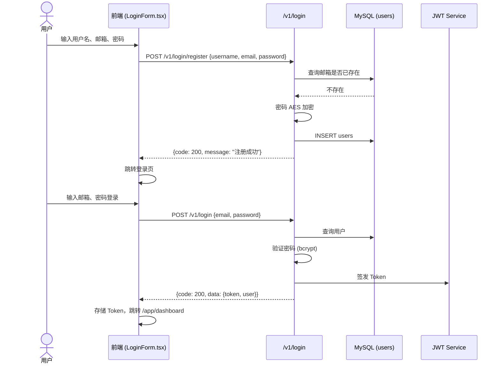
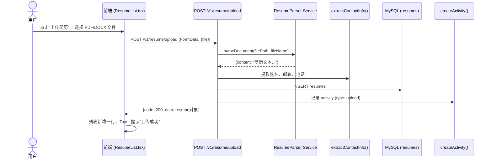
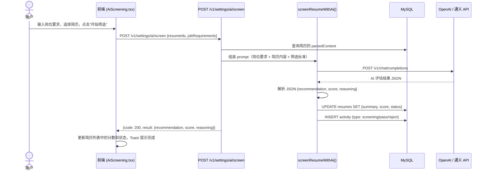
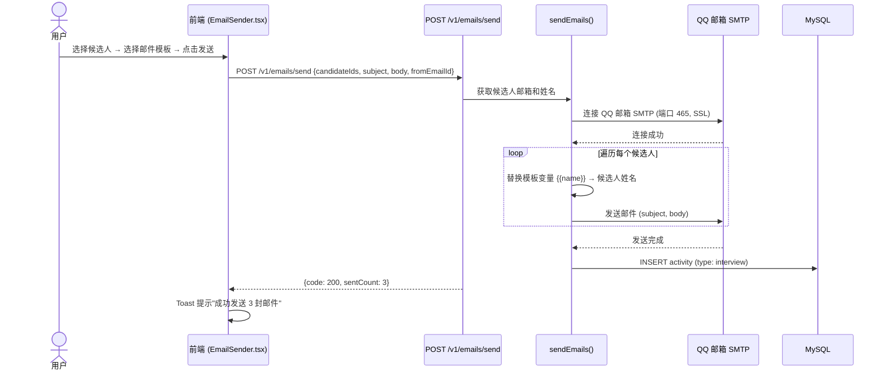
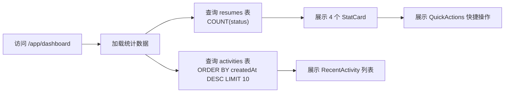
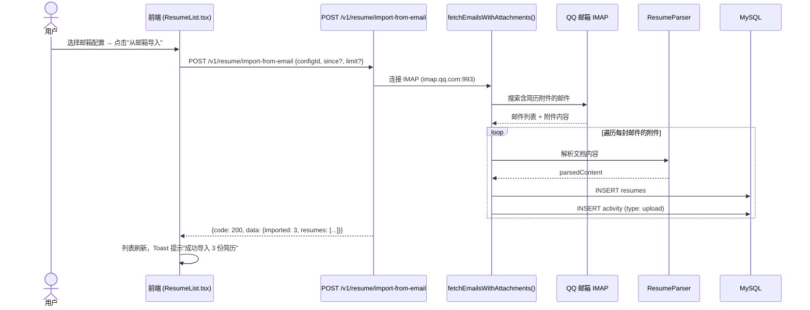

# AI 简历筛选系统 - 系统设计文档

> 本文档基于"需求 → 架构 → 数据库 → 业务逻辑"四步法，完整记录系统的设计过程。

---

## 第一步：从需求到架构

### 系统定位

AI 简历筛选系统是一款面向招聘人员/HR 的 B/S 架构工具，用于上传、解析、AI 评估和管理候选人简历，并支持通过邮件批量发送面试邀请。

### 系统层次架构图

### 模块功能说明

| 模块 | 说明 |
|------|------|
| **登录/注册** | 用户注册、登录，签发 JWT Token |
| **仪表盘** | 展示简历统计、活动日志、操作快捷入口 |
| **简历管理** | 上传简历（本地/邮箱）、解析文档内容、列表展示、删除 |
| **AI 筛选** | 配置 AI API Key，输入岗位要求，AI 批量评估简历并打分 |
| **邮件管理** | 创建/编辑邮件模板，筛选候选人，批量发送面试邀请 |
| **个人设置** | 修改个人资料、配置发件邮箱、管理 AI 配置 |
| **JWT 中间件** | 统一验证请求 Token，保护需要认证的 API |
| **简历解析** | 解析 PDF/DOCX 文件，提取文本内容用于 AI 分析 |
| **邮箱拉取** | 通过 IMAP 协议从 QQ 邮箱自动拉取简历附件 |
| **活动日志** | 记录用户关键操作（上传、筛选、发送邀请等） |

---

## 第二步：数据库建模

> 基于现有 `server/src/db/schema.ts`，提炼核心表结构与示例数据。

### 实体关系图

### 数据表结构

#### 1. users 用户表

| 字段 | 类型 | 说明 | 示例 |
|------|------|------|------|
| id | INT (PK) | 用户ID | 1 |
| username | VARCHAR(255) | 用户名 | "张三" |
| email | VARCHAR(255) | 登录邮箱 | "zhangsan@example.com" |
| password | VARCHAR(255) | 密码（AES加密） | "$2b$10$..." |
| avatar | LONGTEXT | 头像 Base64 | null |
| created_at | TIMESTAMP | 创建时间 | 2026-03-20 10:00:00 |
| updated_at | TIMESTAMP | 更新时间 | 2026-03-20 10:00:00 |

#### 2. resumes 简历表

| 字段 | 类型 | 说明 | 示例 |
|------|------|------|------|
| id | INT (PK) | 简历ID | 1 |
| user_id | INT (FK) | 所属用户 | 1 |
| name | VARCHAR(255) | 候选人姓名 | "李四" |
| email | VARCHAR(255) | 候选人邮箱 | "lisi@example.com" |
| phone | VARCHAR(50) | 候选人电话 | "13800138000" |
| resume_file | VARCHAR(500) | 文件路径 | "uploads/resumes/xxx.pdf" |
| original_file_name | VARCHAR(500) | 原始文件名 | "李四_简历.pdf" |
| file_type | VARCHAR(20) | 文件类型 | "pdf" / "docx" |
| file_size | INT | 文件大小（字节） | 204800 |
| summary | TEXT | AI 评估结论 | "候选人匹配度高..." |
| parsed_content | LONGTEXT | 解析后文本 | "姓名：李四\n电话：..." |
| score | INT | AI 评分 0-100 | 85 |
| status | VARCHAR(20) | 状态 | pending / passed / rejected |
| created_at | TIMESTAMP | 创建时间 | 2026-03-20 10:00:00 |

#### 3. email_configs 邮箱配置表

| 字段 | 类型 | 说明 | 示例 |
|------|------|------|------|
| id | INT (PK) | 配置ID | 1 |
| user_id | INT (FK) | 所属用户 | 1 |
| email | VARCHAR(255) | QQ邮箱地址 | "123456@qq.com" |
| auth_code | VARCHAR(500) | 16位授权码（AES加密） | "$2b$10$..." |
| imap_host | VARCHAR(100) | IMAP 服务器 | "imap.qq.com" |
| imap_port | INT | IMAP 端口 | 993 |
| smtp_host | VARCHAR(100) | SMTP 服务器 | "smtp.qq.com" |
| smtp_port | INT | SMTP 端口 | 465 |
| is_default | BOOLEAN | 是否默认 | true |
| is_deleted | BOOLEAN | 软删除 | false |
| created_at | TIMESTAMP | 创建时间 | 2026-03-20 10:00:00 |
| updated_at | TIMESTAMP | 更新时间 | 2026-03-20 10:00:00 |

#### 4. email_templates 邮件模板表

| 字段 | 类型 | 说明 | 示例 |
|------|------|------|------|
| id | INT (PK) | 模板ID | 1 |
| user_id | INT (FK) | 所属用户 | 1 |
| name | VARCHAR(255) | 模板名称 | "面试邀请模板" |
| subject | VARCHAR(500) | 邮件主题 | "【面试邀请】XXX同学" |
| body | LONGTEXT | 邮件正文（支持模板变量） | "亲爱的 {{name}}..." |
| created_at | TIMESTAMP | 创建时间 | 2026-03-20 10:00:00 |
| updated_at | TIMESTAMP | 更新时间 | 2026-03-20 10:00:00 |

#### 5. ai_configs AI配置表

| 字段 | 类型 | 说明 | 示例 |
|------|------|------|------|
| id | INT (PK) | 配置ID | 1 |
| user_id | INT (FK) | 所属用户 | 1 |
| name | VARCHAR(100) | 配置名称 | "默认配置" |
| model | VARCHAR(100) | AI 模型 | "gpt-4o" |
| api_url | VARCHAR(500) | API 地址 | "https://api.openai.com/v1" |
| api_key | VARCHAR(500) | API Key（AES加密） | "$2b$10$..." |
| prompt | LONGTEXT | 筛选提示词 | "你是一个专业的..." |
| is_default | BOOLEAN | 是否默认 | true |
| created_at | TIMESTAMP | 创建时间 | 2026-03-20 10:00:00 |
| updated_at | TIMESTAMP | 更新时间 | 2026-03-20 10:00:00 |

#### 6. activities 活动日志表

| 字段 | 类型 | 说明 | 示例 |
|------|------|------|------|
| id | INT (PK) | 日志ID | 1 |
| user_id | INT (FK) | 所属用户 | 1 |
| type | VARCHAR(50) | 活动类型 | upload / screening / pass / reject / interview |
| resume_id | INT | 关联简历 | 1 |
| resume_name | VARCHAR(255) | 简历名称（冗余） | "李四_简历.pdf" |
| description | VARCHAR(500) | 描述 | "上传了简历: 李四_简历.pdf" |
| created_at | TIMESTAMP | 创建时间 | 2026-03-20 10:00:00 |

---

## 第三步：业务逻辑设计

### 3.1 MVP 功能清单

| # | 功能模块 | 优先级 | 核心描述 |
|---|----------|--------|----------|
| 1 | 用户登录注册 | P0 | 用户注册、登录，获取 JWT Token |
| 2 | 简历上传 | P0 | 本地上传 PDF/DOCX 文件，自动解析文本内容 |
| 3 | AI 简历筛选 | P0 | 输入岗位要求，AI 评估简历并打分（0-100） |
| 4 | 简历列表管理 | P1 | 按状态筛选、查看详情、批量操作、删除 |
| 5 | 邮件发送 | P1 | 创建模板，从通过筛选的简历中选取候选人，发送面试邀请 |
| 6 | 仪表盘统计 | P2 | 展示简历总数、通过/拒绝数、近期活动 |
| 7 | 邮箱导入简历 | P2 | 通过 IMAP 从 QQ 邮箱自动拉取简历附件 |

---

### 3.2 功能 1：用户登录注册

#### ① 正常路径

#### ② 数据盘点

| 类型 | 数据 |
|------|------|
| 输入 | username, email, password |
| 输出 | token (JWT), user {id, username, email, avatar} |
| 存储 | users 表新增一条记录 |

#### ③ 异常流程

| 场景 | 处理方式 |
|------|----------|
| 邮箱已注册 | 返回 400: "该邮箱已注册" |
| 密码长度 < 6 位 | 返回 400: "密码至少6位" |
| 用户不存在 | 返回 400: "邮箱或密码错误" |
| 密码错误 | 返回 400: "邮箱或密码错误"（不区分具体字段，防止枚举攻击） |
| Token 过期 | 返回 401: 前端跳转登录页 |

#### ④ API 接口

| 接口 | 方法 | 路径 | 请求体 | 说明 |
|------|------|------|--------|------|
| 注册 | POST | /v1/login/register | `{username, email, password}` | 用户注册 |
| 登录 | POST | /v1/login | `{email, password}` | 用户登录，返回 Token |
| 个人信息 | GET | /v1/settings/profile | Header: `Authorization: Bearer <token>` | 获取当前用户信息 |

---

### 3.3 功能 2：简历上传

#### ① 正常路径

#### ② 数据盘点

| 类型 | 数据 |
|------|------|
| 输入 | file (PDF/DOCX/DOC), 可选: name, email, phone |
| 输出 | resume对象 {id, name, email, phone, fileType, status, ...} |
| 副作用 | 简历文件保存到 `server/uploads/resumes/` 目录；activity 日志新增一条 |

#### ③ 异常流程

| 场景 | 处理方式 |
|------|----------|
| 未选择文件 | 返回 400: "请选择要上传的文件" |
| 文件类型不支持 | 返回 400: "不支持的文件类型" |
| 文件为空 | 返回 400: "PDF 文件为空" |
| PDF 是图片扫描件（无文本） | 返回 400: "PDF 中没有可提取的文本内容" |
| 文件解析失败 | 删除已上传文件，返回错误信息 |
| 文件名含中文乱码 | 使用 decodeURIComponent 尝试解码 |

#### ④ API 接口

| 接口 | 方法 | 路径 | 请求体 | 说明 |
|------|------|------|--------|------|
| 上传简历 | POST | /v1/resume/upload | FormData `{file}` | 单文件上传，支持 PDF/DOCX |
| 获取列表 | GET | /v1/resumes | - | 获取当前用户所有简历 |
| 删除简历 | DELETE | /v1/resume/:id | - | 删除指定简历（同时删除文件） |

---

### 3.4 功能 3：AI 简历筛选

#### ① 正常路径

#### ② 数据盘点

| 类型 | 数据 |
|------|------|
| 输入 | resumeIds (number[]), jobRequirements (string), 可选 aiConfigId |
| 输出 | `{recommendation: "pass"\|"reject"\|"pending", score: 0-100, reasoning: string}` |
| 副作用 | resumes 表 score/summary/status 更新；activities 表新增记录 |

#### ③ 异常流程

| 场景 | 处理方式 |
|------|----------|
| 未配置 AI API Key | 返回 400: "请先配置 AI API Key" |
| 简历内容为空（扫描件） | 返回 400，提示无法筛选图片扫描件 |
| AI API 请求超时（>10s） | 返回 400: "AI 请求超时" |
| AI 返回格式非法 | 兜底解析（识别关键词"推荐/拒绝/通过"），默认 pending |
| API Key 无效 (401) | 返回 400: "API Key 无效或过期" |
| 余额不足 (403) | 返回 400: "API Key 无权限或免费额度耗尽" |

#### ④ API 接口

| 接口 | 方法 | 路径 | 请求体 | 说明 |
|------|------|------|--------|------|
| AI 筛选 | POST | /v1/settings/ai/screen | `{resumeIds[], jobRequirements, aiConfigId?}` | 单个或批量 AI 筛选 |
| 获取 AI 配置 | GET | /v1/settings/ai | - | 获取用户 AI 配置列表 |
| 保存 AI 配置 | POST | /v1/settings/ai | `{name, model, apiUrl, apiKey, prompt}` | 创建 AI 配置 |
| 测试 AI 连接 | POST | /v1/settings/ai/test | `{model, apiUrl, apiKey}` | 测试 API Key 是否有效 |

---

### 3.5 功能 4：邮件发送（面试邀请）

#### ① 正常路径

#### ② 数据盘点

| 类型 | 数据 |
|------|------|
| 输入 | candidateIds (number[]), subject (string), body (string), fromEmailId (number) |
| 输出 | `{success: true, sentCount: 3, failedCount: 0}` |
| 副作用 | activities 表新增 `type: interview` 记录 |

#### ③ 异常流程

| 场景 | 处理方式 |
|------|----------|
| 未选择发件邮箱 | 返回 400: "发件邮箱、主题和内容不能为空" |
| SMTP 连接失败 | 返回 400: "邮箱连接失败，请检查授权码" |
| 部分发送失败 | 返回 200，但告知成功/失败数量 |
| 候选人邮箱为空 | 跳过该候选人，不阻塞其他发送 |
| 授权码错误 | 返回 400: "SMTP 认证失败，请检查授权码" |

#### ④ API 接口

| 接口 | 方法 | 路径 | 说明 |
|------|------|------|------|
| 获取邮件模板 | GET | /v1/email-templates | 获取模板列表 |
| 创建模板 | POST | /v1/email-templates | 新建邮件模板 |
| 更新模板 | PUT | /v1/email-templates/:id | 编辑模板 |
| 删除模板 | DELETE | /v1/email-templates/:id | 删除模板 |
| 获取收件人 | GET | /v1/email-recipients | 获取候选人列表（支持按状态筛选） |
| 发送邮件 | POST | /v1/emails/send | 批量发送邮件 |

---

### 3.6 功能 5：仪表盘统计

#### ① 正常路径

#### ② 数据盘点

| 类型 | 数据 |
|------|------|
| 输入 | 无（从 Token 解析 userId） |
| 输出 | `{total, passed, rejected, pending, recentActivities[]}` |

#### ③ 异常流程

| 场景 | 处理方式 |
|------|----------|
| 数据库查询失败 | 返回 500，页面展示"加载失败" |
| 无任何简历 | 返回 200，页面展示 0 和空活动列表 |

---

### 3.7 功能 6：邮箱导入简历

#### ① 正常路径

#### ② 异常流程

| 场景 | 处理方式 |
|------|----------|
| 未配置邮箱 | 返回 400: "请先配置发件邮箱" |
| IMAP 连接失败 | 返回 400: "邮箱连接失败，请检查授权码" |
| 未找到简历附件 | 返回 200: "未找到包含简历附件的邮件" |
| 附件格式不支持 | 跳过该附件，继续处理其他邮件 |
| 授权码无 IMAP 权限 | 返回 400: "授权码无 IMAP 权限，请开启" |

---

## 第四步：AI 协助评审（架构师视角）

> 以下是 AI 架构师对当前设计的评审意见。

---

### 评审维度 1：逻辑漏洞扫描

| 问题 | 严重程度 | 说明 |
|------|----------|------|
| 简历归属校验缺失 | ⚠️ 中 | 当前 `GET /v1/resumes` 未校验 `userId`，所有用户可见所有简历 |
| Token 校验不一致 | ⚠️ 中 | 部分接口（如 `GET /resumes`）未使用 `authenticate` 中间件 |
| 批量操作无原子性 | ⚠️ 低 | 批量 AI 筛选中途失败，已筛选的简历无法回滚 |

### 评审维度 2：防御性设计

| 遗漏场景 | 建议 |
|----------|------|
| 重复上传同一简历 | 建议基于 `originalFileName + fileSize` 生成哈希校验，提示用户 |
| 简历内容过长（>100KB） | AI API 的 `max_tokens: 600` 可能不够，建议截断或分段 |
| 并发上传同一文件 | 建议前端加锁，防止重复提交 |
| 邮件发送频率限制 | 建议增加冷却时间（同一候选人 24h 内不重复发送） |

### 评审维度 3：技术选型匹配度

| 挑战 | JSON-Server 替代方案对比 | 当前方案评估 |
|------|-------------------------|-------------|
| AI 筛选需要调用外部 API | JSON-Server 无 HTTP 代理能力，需 Node.js 后端 | ✅ 当前 Express 方案正确 |
| 文件上传与解析 | JSON-Server 无文件处理能力 | ✅ 当前 Multer + 解析服务方案正确 |
| 敏感信息加密 | JSON-Server 无加密能力 | ✅ 当前 bcrypt/AES 加密方案正确 |
| 邮箱 IMAP 拉取 | JSON-Server 无 IMAP 支持 | ✅ 当前 nodemailer 方案正确 |
| 多用户数据隔离 | JSON-Server 可通过 query 参数过滤，但无强隔离 | ⚠️ 当前 MySQL + userId 方案更安全 |

### 评审维度 4：数据一致性

| 问题 | 建议 |
|------|------|
| activities.resumeName 冗余存储 | 合理，用于简历删除后仍可展示日志 |
| emailConfigs.auth_code 未校验格式 | 建议增加 16 位授权码格式校验 |
| 简历状态枚举未建约束 | 建议在数据库层添加 CHECK 约束 |
| aiConfigs.apiKey 明文传输 | 建议 HTTPS 全链路加密，当前开发环境可接受 |

---

## 附录：技术栈汇总

| 层级 | 技术选型 |
|------|----------|
| 前端框架 | React 18 + TypeScript + Vite |
| 前端路由 | React Router v6 |
| 状态管理 | Zustand |
| HTTP 客户端 | Axios |
| 后端框架 | Express + TypeScript |
| ORM | Drizzle ORM |
| 数据库 | MySQL 8 |
| 文件解析 | pdf-parse (PDF), mammoth (DOCX) |
| AI 集成 | OpenAI SDK / 阿里云通义千问 |
| 邮件协议 | nodemailer (SMTP/IMAP) |
| 认证 | JWT (jsonwebtoken) |
| 密码加密 | bcrypt |
| 部署 | 本地开发，Vite 开发服务器 + tsx 后端 |
